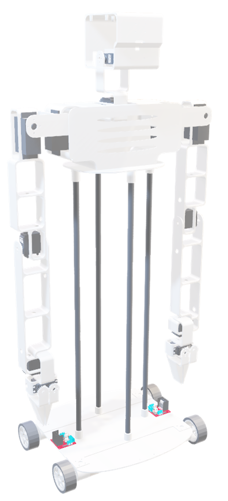

# Alice — Humanoider VR-Telepresence-Roboter 🤖

Ein humanoider Roboter, entwickelt für die Fernsteuerung mittels Virtual-Reality-(VR)-Headsets. Dient als vielseitiger Avatar mit Potenzial zur zukünftigen Integration in das [LESS-Projekt](#).


<!-- Bild/GIF hier einfügen, sobald vorhanden -->

## Features

- **VR-Integration** — Steuerung über ein Meta Quest 3S Headset, Umgebungswahrnehmung in Echtzeit über Kamera
- **Inside Out Body Tracking (IOBT)** — Arme und Beine bewegen sich synchron mit den Nutzerbewegungen
- **Erschwingliches Design** — Nutzt einen Raspberry Pi 3A+ für Grundfunktionen bei niedrigen Kosten
- **Kopfsteuerung über Headset** — Kopfbewegungen des Nutzers werden erfasst und auf Alice übertragen
- **Echtzeit-Bildübertragung** — Live-Kamerabild direkt auf das VR-Headset

## Hardware

| Komponente | Details |
|---|---|
| Compute | Raspberry Pi 3A+ |
| VR-Headset | Meta Quest 3S |
| Tracking | Inside Out Body Tracking (IOBT) <!-- Sensoren/Methode ergänzen --> |
| Kamera | Joy It Kamera 8MP 120° |
| Aktuatoren | 4x Servo DS3240 40kg/cm + 4x 85kg/cm + 4x Servo DM996 13kg/cm + 4x Getriebemotor 12V, 26rpm, 4,4kg/cm|
| Stromversorgung | 12V Labornetzteil |

## Software-Stack

- **Steuerung/Firmware:** Python
- **VR-Anbindung:** Unity/OpenXR für Meta Quest 3S
- **Bildübertragung:** Websocket
- **Tracking-Pipeline:** IOBT-Datenverarbeitung → Motoransteuerung

## Setup

```bash
git clone https://github.com/Timodrien/alice.git
cd alice

# Python-Abhängigkeiten
pip install -r requirements.txt

# Auf dem Raspberry Pi 3A+ ausführen
# <Startbefehl ergänzen>
```

Konfiguration (WLAN-Zugangsdaten, API-Keys etc.) liegt in `config.example.h` — kopieren nach `config.h` und mit eigenen Werten befüllen. `config.h` ist in `.gitignore` und wird nicht mit hochgeladen.

## Projektstruktur

```
alice/
├── src/
│   ├── control/         # Bewegungssteuerung, IOBT-Verarbeitung
│   ├── vr-bridge/        # Verbindung zum VR-Headset
│   └── streaming/        # Kamera-/Bildübertragung
├── hardware/              # CAD/STL-Dateien, Wiring-Diagramme
├── docs/images/           # Bilder & GIFs für README
├── config.example.h
└── README.md
```

## Verwandte Projekte

- [LESS-Projekt](#) — geplante zukünftige Integration von Alice als Avatar
- Smartphone-App zur Steuerung von Alice, Fox und SMV

## Roadmap / Ideen

<!-- optional: geplante Erweiterungen, offene TODOs -->

## Lizenz

<!-- MIT o.ä. einfügen, oder Zeile entfernen wenn keine Lizenz gewünscht -->
